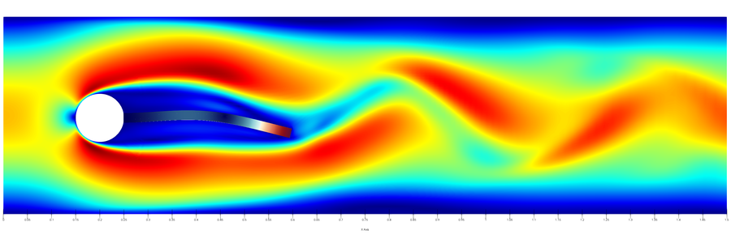
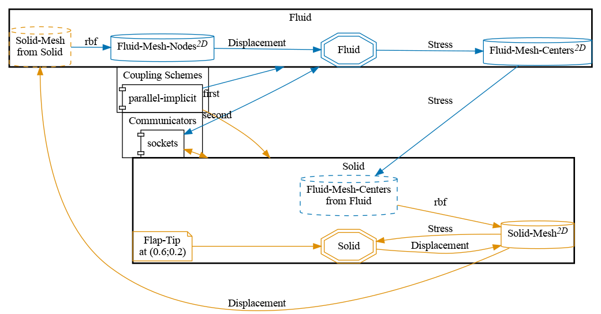
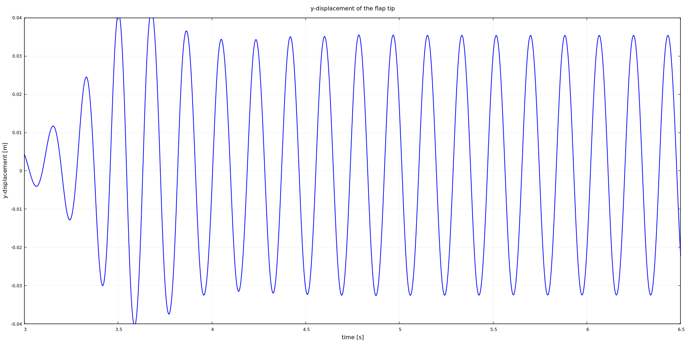


Get the [case files of this tutorial](https://github.com/precice/tutorials/tree/master/turek-hron-fsi3). Read how in the [tutorials introduction](https://precice.org/tutorials.html).


## Setup

The setup is shown schematically here:



For more information please refer to the original publication of the benchmark [1].

## Configuration

preCICE configuration (image generated using the [precice-config-visualizer](https://precice.org/tooling-config-visualization.html)):



## Available solvers

Fluid participant:

* OpenFOAM (pimpleFoam). In case you are using a very old OpenFOAM version, you will need to adjust the solver to `pimpleDyMFoam` in the `Fluid/system/controlDict` file. For more information, have a look at the [OpenFOAM adapter documentation](https://precice.org/adapter-openfoam-overview.html).
* Nutils. For more information, have a look at the [Nutils adapter documentation](https://precice.org/adapter-nutils.html). This Nutils solver requires at least Nutils v9.0. This case takes significantly longer to run than the OpenFOAM case, see [related issue](https://github.com/precice/tutorials/issues/506).

Solid participant:

* deal.II. For more information, have a look at the [deal.II adapter documentation](https://precice.org/adapter-dealii-overview.html). This tutorial requires the nonlinear solid solver. Please copy the nonlinear solver executable to the `solid-dealii` folder or make it discoverable at runtime and update the `solid-dealii/run.sh` script.
* Nutils. For more information, have a look at the [Nutils adapter documentation](https://precice.org/adapter-nutils.html). This Nutils solver requires at least Nutils v9.0.

## Running the Simulation

Open two separate terminals and start each participant by calling the respective run script. For example:

```bash
cd fluid-openfoam
./run.sh
```

and

```bash
cd solid-dealii
./run.sh
```

You can also run OpenFOAM in parallel by `./run.sh -parallel`. The default setting here uses 25 MPI ranks. You can change this setting in `fluid-openfoam/system/decomposeParDict`.

You may adjust the end time in the `precice-config.xml`, or interrupt the execution earlier if you want.

In the first few timesteps, many coupling iterations are required for convergence. Don't lose hope, things get better quickly.

## Post-processing

You can visualize the results of the coupled simulation using e.g. ParaView. OpenFOAM uses an OpenFOAM-specific format, and you can directly load the (empty) file `fluid-openfoam.foam` in Paraview or convert the results to VTK with `foamToVTK`. deal.II writes VTK files. Both Nutils solvers currently do not write VTK files (but use their own in-situ visualization), but this can be easily added similarly to the [perpendicular flap solvers](https://github.com/precice/tutorials/blob/98a78fe2dc2f6c5d84b2b30d35d00352782236f8/perpendicular-flap/fluid-nutils/fluid.py#L227).

If you want to visualize both domains with ParaView, keep in mind that the different solvers may write results with different output frequencies, which you might want to [synchronize](https://precice.org/tutorials-visualization.html#synchronizing-results).

There is a [known issue](https://github.com/precice/openfoam-adapter/issues/26) that leads to additional "empty" result directories when running with some OpenFOAM versions, leading to inconveniences during post-processing. At the end of `run.sh`, we call `openfoam_remove_empty_dirs` (provided by `tools/openfoam-remove-empty-dirs`) to delete the additional files before importing the results in ParaView.

Moreover, as we defined a watchpoint at the flap tip (see `precice-config.xml`), we can plot it with gnuplot using the script `plot-displacement.sh`, which expects the directory of the selected solid participant as a command line argument. For example:

 ```shell
 plot-displacement.sh solid-dealii



Before running the simulation again, you may want to cleanup any result files using the script `clean-tutorial.sh`.

## Mesh refinement

In `fluid-openfoam/system/`, we provide three different fluid meshes:

* `blockMeshDict`: the default mesh with approximately 21k cells,
* `blockMeshDict_refined`: a refined mesh with approximately 38k cells,
* `blockMeshDict_double_refined`: a refined mesh with approximately 46k cells.

If you want to use one of the two refined meshes, simply swap the `blockMeshDict`:

```bash
mv blockMeshDict blockMeshDict_original
mv blockMeshDict_refined blockMeshDict
```

## Acknowledgements

Thanks to the Technical University of Eindhoven for funding the development of
the Nutils participants for this tutorial.

## References

[1]  S. Turek, J. Hron, M. Madlik, M. Razzaq, H. Wobker, and J. Acker. Numerical simulation and benchmarking of a monolithic multigrid solver for fluid-structure interaction problems with application to hemodynamics. In H.-J. Bungartz, M. Mehl, and M. Schäfer, editors, Fluid Structure Interaction II: Modelling, Simulation, Optimization, page 432. Springer Berlin Heidelberg, 2010.


This offering is not approved or endorsed by OpenCFD Limited, producer and distributor of the OpenFOAM software via www.openfoam.com, and owner of the OPENFOAM®  and OpenCFD®  trade marks.

